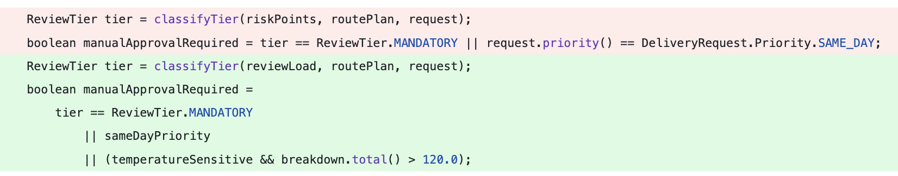

# reviewability

**A CI/CD quality gate that scores pull requests by how hard they are to review.**

Catch diffs that are too large, too tangled, or too scattered to review safely — before they merge.


*It doesn't matter how fast AI generates code — the bottleneck is the human reviewer.*

## Installation

```bash
pip install reviewability
```

Requires Python 3.12+.

**Dependencies:** [`unidiff`](https://pypi.org/project/unidiff/) (diff parsing), [`rapidfuzz`](https://pypi.org/project/rapidfuzz/) (fast string similarity for move detection).

## The Idea

A pull request can be hard to review not because the code is poorly written, but because of
how the changes are combined. Mixing renames, movements, and logic changes in one PR
makes each harder to verify. This is especially common with AI-generated code. Unlike
linters, Reviewability does not analyze the code — only how the changes are structured.



*A clean-code change can still turn into a reviewability disaster when refactors, renames, and behavior updates are mixed together.*

When a diff scores low, the typical remedies are splitting it into focused pull
requests or deferring non-essential changes.

Reviewability computes metrics at the level of individual hunks, code moves, files, and the
whole diff, feeding into **Reviewability Scores** (0.0 = hardest, 1.0 = easiest) with
configurable thresholds for what counts as problematic.

## Key Concepts

- **Hunk** — a contiguous block of changes within a single file (the smallest unit of analysis)
- **HunkType** — classification of a hunk: `pure_addition`, `pure_deletion`, `move`, or `mixed`
- **Move** — two or more hunks that are likely connected (e.g. a code move or cross-hunk rewrite), detected by move-aware similarity
- **MoveType** — `pure` (high similarity, essentially relocated) or `modified` (relocated and changed)
- **Metric** — a calculated value attached to a hunk, a move, a file, or the whole diff
- **Score** — a float [0.0, 1.0] representing reviewability at hunk, move, file, or diff level

## Extensibility

The metric system is designed to be extended:

- **Add a metric** — subclass `HunkMetric`, `MoveMetric`, `FileMetric`, or `OverallMetric`, implement `calculate()`, register via `registry.add()`
- **Adjust scoring** — provide a custom `ReviewabilityScorer` implementation
- **Adjust thresholds** — edit the [default config](src/reviewability/config/reviewability.toml) or provide your own `reviewability.toml`

## Usage

```bash
# Analyze a range of commits
reviewability HEAD~1 HEAD

# Analyze from stdin
git diff HEAD~1 | reviewability --from-stdin

# Use a custom config
reviewability --config path/to/reviewability.toml HEAD~1 HEAD

# Include per-file and per-hunk breakdowns
reviewability --detailed HEAD~1 HEAD
```

Output is JSON. Exit code is `0` if the gate passes, `1` if it fails.

## Claude Code Skill

If you use [Claude Code](https://claude.ai/code), a `/reviewability` skill is included.
It runs the tool on the current diff, summarizes the results, and attempts to address
any recommendations directly.

## Configuration

All thresholds and limits are configured via a single `reviewability.toml` file.
The tool looks for it in the current directory, or you can specify a path explicitly:

```bash
reviewability -c path/to/reviewability.toml HEAD~1 HEAD
```

If no config file is found, the
[built-in default](src/reviewability/config/reviewability.toml) is used. You can
edit that file directly to change the defaults, or copy it into your project root.
The config must contain all mandatory fields — there is no merging with defaults.

```toml
# Scores below these thresholds mark hunks/files as problematic
hunk_score_threshold = 0.5
file_score_threshold = 0.5

# Size limits (used for score normalisation)
max_diff_lines = 500
max_hunk_lines = 50

# Move scoring: size limit and similarity penalty
# penalty_per_line = (1 + move_similarity_penalty × (1 − similarity)) / max_move_lines
max_move_lines = 100
move_similarity_penalty = 2.0

# Gate: fail if overall score drops below this
min_overall_score = 0.7

# Optional limits (remove a line to disable that check)
max_problematic_hunks = 3
# max_problematic_moves = 2
max_problematic_files = 2
max_files_changed = 10
max_added_lines = 400

# Optional: per-extension line prefixes to exclude from analysis.
# Lines starting with any of these prefixes are stripped before metrics are computed,
# so import-only changes do not inflate hunk sizes or interleaving scores.
# Use "*" as the fallback for file types not listed.
# Remove this section entirely to use the built-in defaults.
[excluded_prefixes]
"*"   = ["import ", "#include ", "extern crate ", "package "]
".py" = ["import ", "from "]
".go" = ["import ", "package "]
".ts" = ["import ", "from ", "require("]
# ... (full list of extensions in the built-in config)
```

## Code Moves

When two hunks are likely connected — for example, code deleted from one location and
inserted elsewhere — they are paired into a **move**. Moves are detected using
move-aware similarity: each deleted line is matched to the most similar added line across
hunk pairs, normalized by the larger side.

Moves are classified by their similarity score:

- **`pure`** — similarity ≥ 0.9: content is essentially identical, just relocated
- **`modified`** — similarity 0.3–0.9: content was moved and changed

Hunks that pair with no other hunk remain as **singletons** and are not included in any move.
Import/package declarations and indentation differences are ignored during similarity
comparison, so pure reindentation or import reordering does not suppress a move detection.

Hunk-level scoring and the problematic hunk count only apply to singletons. Hunks in moves
are evaluated at the move level instead.

## Metrics

Metrics are calculated at four levels: hunk, move, file, and overall diff.

All size metrics and `hunk.interleaving` exclude blank lines and import/package declarations,
so import-only or formatting-only changes do not inflate scores. The list of excluded prefixes
is configurable per file extension via `[excluded_prefixes]` in the config.

### Hunk-level

Computed only for **singleton hunks** (not part of any move).

| Metric | Description |
|--------|-------------|
| `hunk.lines_changed` | Meaningful lines added and removed in a hunk |
| `hunk.added_lines` | Meaningful lines added in a hunk |
| `hunk.removed_lines` | Meaningful lines removed in a hunk |
| `hunk.context_lines` | Unchanged context lines surrounding the change |
| `hunk.change_balance` | Ratio of added lines to total changed lines (0.0 = pure deletion, 1.0 = pure addition) |
| `hunk.interleaving` | How much additions and deletions alternate within the hunk (0.0 = clean block substitution, 1.0 = every line alternates). Higher = harder to review. |

### Move-level

| Metric | Description |
|--------|-------------|
| `move.edit_complexity` | Edit complexity of a detected code move. Pure relocations score high (1.0); heavy rewrites score low (0.0). |

### File-level

| Metric | Description |
|--------|-------------|
| `file.lines_changed` | Meaningful lines added and removed across all hunks in a file |

### Overall-level

| Metric | Description |
|--------|-------------|
| `overall.lines_changed` | Total meaningful lines changed across the entire diff |
| `overall.added_lines` | Total meaningful lines added across the entire diff |
| `overall.files_changed` | Number of files changed |
| `overall.scatter_factor` | Normalized entropy of how changes are distributed across files (0.0 = all in one file, 1.0 = evenly spread) |
| `overall.problematic_hunk_count` | Singleton hunks with a score below the configured threshold |
| `overall.problematic_move_count` | Moves with a score below the configured threshold |
| `overall.problematic_file_count` | Files with more than one hunk and a score below the configured threshold |

## Scoring

### Hunk score (singletons only)

```
score = max(0, 1 − (lines_changed / max_hunk_lines) × (1 + interleaving))
```

`interleaving` measures how much additions and deletions alternate within the hunk. When all
additions come before all deletions (or vice versa), `interleaving = 0.0` and the formula
reduces to the plain size ratio. When every line alternates type, `interleaving = 1.0` and
the size penalty doubles.

### Move score

```
penalty_per_line = (1 + move_similarity_penalty × (1 − similarity)) / max_move_lines
score = max(0, 1 − length × penalty_per_line)
```

`length` is the meaningful-line size of the largest hunk in the move. When similarity
is high (pure move), the per-line penalty is close to `1/max_move_lines` — equivalent
to hunk scoring. When similarity is low (rewrite), the penalty grows proportionally,
so the same number of lines scores worse.

### Overall score

```
score = max(0, 1 − size_ratio × (1 + scatter_factor))

size_ratio = lines_changed / max_diff_lines   [capped at 1.0]
```

The score is driven by **diff size** and **scatter**. `scatter_factor` measures how evenly
changes are spread across files (normalized entropy, 0.0 = all in one file, 1.0 = evenly
spread). It amplifies the size penalty: a large diff that touches many files evenly scores
worse than an equally large diff concentrated in a few files.

A large but focused diff (e.g. a bulk rename in one file) or a scattered but small diff
each score better than a diff that is both large *and* scattered.

## Validation

The scoring formula was calibrated against ~2,000 pull requests from 15 permissively
licensed open-source repositories. Ground truth labels were derived from review outcomes
(change requests, revision cycles, comment density). Metrics that did not improve
prediction over a naive size baseline were removed from the formula.

## Research

Metrics are informed by peer-reviewed research on code review effectiveness. Most are heuristics derived from research concepts rather than direct paper-defined variables:

- Jureczko et al. — *Code review effectiveness: an empirical study on selected factors influence* (IET Software, 2021)
  https://doi.org/10.1049/iet-sen.2020.0134

- McIntosh et al. — *An Empirical Study of the Impact of Modern Code Review Practices on Software Quality* (EMSE, 2015)
  https://doi.org/10.1007/s10664-015-9381-9

- Fregnan et al. — *First Come First Served: The Impact of File Position on Code Review* (EMSE, 2022)
  https://doi.org/10.1007/s10664-021-10034-0

- Uchôa et al. — *Predicting Design Impactful Changes in Modern Code Review* (MSR, 2020)
  https://doi.org/10.1145/3379597.3387480

- Baum et al. — *The Choice of Code Review Process: A Survey on the State of the Practice* (EMSE, 2019)
  https://doi.org/10.1007/s10664-018-9657-6

- Hijazi et al. — *Using Biometric Data to Measure Code Review Quality* (TSE, 2021)
  https://doi.org/10.1109/TSE.2020.2992169

- Olewicki et al. — *Towards Better Code Reviews: Using Mutation Testing to Prioritise Code Changes* (2024)
  https://arxiv.org/abs/2402.01860

- Barnett et al. — *Helping Developers Help Themselves: Automatic Decomposition of Code Review Changesets* (ICSE, 2015)
  https://doi.org/10.1109/ICSE.2015.35

- Brito & Valente — *RAID — Refactoring-Aware and Intelligent Diffs* (2021)
  https://doi.org/10.1109/ICSME52107.2021.00037

- Hu & Pradel — *CodeMapper: Mapping and Analyzing Code Changes across Commits* (ICSE, 2026)
